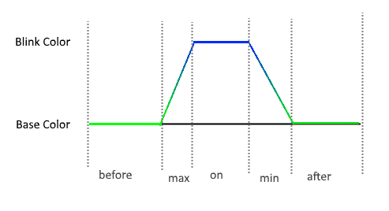

# Blink effect

* Author: Adriano Petrucci
* Version: 1.0
* Changelog:
    * 1.0:
        * First version

## Parameters
Parameter | Description | Values
--- | --- | ---
`delay before`|time until the blink will begins.|0 to 30000ms
`delay for max`|fade time to reach the second color.|0 to 30000ms
`delay ON`|time leaving the second color.|0 to 30000ms
`delay for min`|fade time to reach the first color.|0 to 30000ms
`delay after`|time to leave the second color before next effect will start|0 to 30000
`every`|only every X led should blink|1 to leds quantity
`delay`|time between the steps, try to leave it as high as possible (this for all effects)*|1 to infinite

*delay: After setting the colors on the led strip, the timer need up to 0.07ms for each led. If you have 60 leds the Arduino need up to 4ms to update the strip. Remember it when you decrease this value.

## Description

The blink effect will show a second color for some time. This can create for example a strobo effect if times are low.

