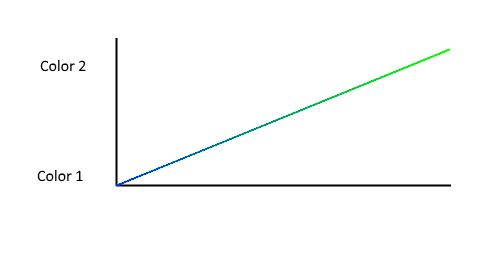

# Fade effect

* Author: Adriano Petrucci
* Version: 1.2
* Changelog:
    * 1.2:
        * Solved a bug on duration (instead of fading, it was blinking if the duration was too high)
    * 1.1:
        * Updated for Version 2.0
    * 1.0:
        * First version

## Parameters
Parameter | Description | Values
--- | --- | ---
`duration`|Time to reach the end color|2 to 30000ms
`delay`|time between the steps, try to leave it as high as possible (this for all effects)*|1 to infinite

*delay: After setting the colors on the led strip, the timer need up to 0.07ms for each led. If you have 60 leds the Arduino need up to 4ms to update the strip. Remember it when you decrease this value.

## Description

This will change the color from the strip in a slow way. Duration must be a multiply from delay. If you set the duration like delay, you will have a hard change between the 2 colors.

