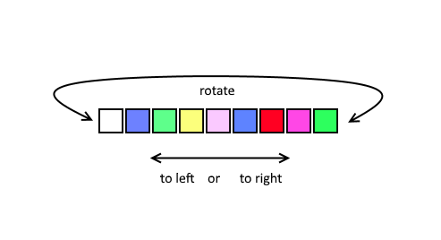

# Fade effect

* Author: Adriano Petrucci
* Version: 1.0
* Changelog:
    * 1.0:
        * First version

## Parameters
Parameter | Description | Values
--- | --- | ---
`direction`|if animation should go to left or right|left or right
`rotate`|if the last led should get the color of the first led (circle) or just move the colors out of the strip|yes or no
`steps`|how many steps you want to move the colors|1 to led quantity
`delay`|time between the steps, try to leave it as high as possible (this for all effects)*|1 to infinite

*delay: After setting the colors on the led strip, the timer need up to 0.07ms for each led. If you have 60 leds the Arduino need up to 4ms to update the strip. Remember it when you decrease this value.

## Description

The colors will move right or left as they are. You can choose if they should move to right or to left and if the colors should rotate.
Remember that you need an effect to colorize the led before apply this effect!

