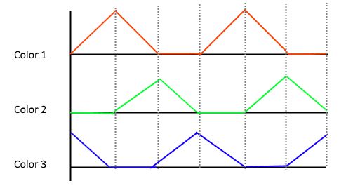

# Rainbow effect

* Author: Adriano Petrucci
* Version: 1.0
* Changelog:
    * 1.0:
        * First version

## Parameters
Parameter | Description | Values
--- | --- | ---
`steps`|steps to reproduce the entire animation, smaller values will give a faster but laggy effect bigger values will give a slower but more fluent effect.|1 to infinite
`length`|rainbow length, if this one has the same size as the led strip, you will see all colors on the same strip.|1 to infinite
`toLeft`|direction of the rainbow animation|to left or to right
`delay`|time between the steps, try to leave it as high as possible (this for all effects)*|1 to infinite

*delay: After setting the colors on the led strip, the timer need up to 0.07ms for each led. If you have 60 leds the Arduino need up to 4ms to update the strip. Remember it when you decrease this value.

## Description

The rainbow effect can be done with at least 2 colors. The value of each color will change during the time (see image above)
